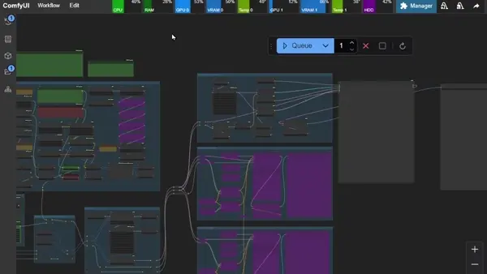
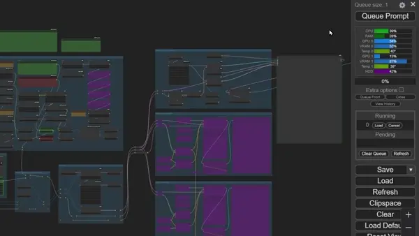
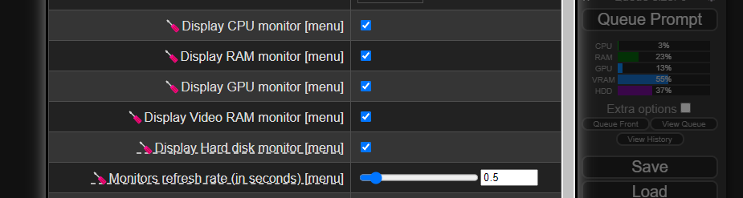

<p align="center">
  
</p>

<h1 align="center">ComfyUI-UsageMonitor</h1>

<p align="center">
<a href="../zh/README.md">中文 (简体)</a> &nbsp;|&nbsp; <a href="../zh-Hant/README.md">中文 (繁體)</a> &nbsp;|&nbsp; English
</p>

<p align="center">
  
  
</p>

Watch your system resources (CPU, GPU, RAM, VRAM, GPU temperature and disk space) directly on the ComfyUI menu in real-time, so you can identify bottlenecks in your workflow and know when it is time to restart the server, unload models or close some tabs.

## Resources monitor

**🎉 Finally, you can see the resources used by ComfyUI (CPU, GPU, RAM, VRAM, GPU Temp and space) on the menu in real-time!**

Horizontal:  


Vertical:  


Now you can identify the bottlenecks in your workflow and know when it's time to restart the server, unload models or even close some tabs! You can configure the refresh rate and which resources to show:



> **Notes:**
> - The GPU data is available when you use CUDA (NVIDIA) or AMD (via ADLX on Windows).
> - This extension needs ComfyUI 1915 (or higher).
> - The cost of the monitor is low (0.1 to 0.5% of utilization), you can disable it from settings (`Refresh rate` to `0`).
> - Data comes from these libraries: [psutil](https://pypi.org/project/psutil/), [torch](https://pytorch.org/), [nvidia-ml-py](https://pypi.org/project/nvidia-ml-py/) (official NVIDIA library) and [ADLXPybind](https://pypi.org/project/adlxpybind/) (official AMD ADLX library, Windows).

## Features

Feature | Description
--- | ---
Real-time monitoring | CPU, GPU, RAM, VRAM, GPU temperature and disk space shown live on the ComfyUI menu
NVIDIA & AMD support | CUDA via `nvidia-ml-py`, AMD via `ADLXPybind` (Windows)
Horizontal & vertical layouts | Pick the monitor layout that fits your workflow
Fully configurable | Refresh rate and shown resources are configurable from the settings menu

---

## Installation

1. Install [ComfyUI](https://github.com/comfyanonymous/ComfyUI).
2. Clone this repo into `custom_nodes` (see below).
3. Start up ComfyUI.

```
cd ComfyUI/custom_nodes
git clone https://github.com/576576/ComfyUI-UsageMonitor.git
cd ComfyUI-UsageMonitor
pip install -r requirements.txt
```

> **For AMD users (Windows):** GPU monitoring works out of the box via ADLX (`adlxpybind`) — install normally as described above.

### Install from manager

Search for `usagemonitor` in the [manager](https://github.com/ltdrdata/ComfyUI-Manager.git) and install it.

## Project structure

```text
ComfyUI-UsageMonitor/
├── general/               hardware info (CPU / GPU / HDD)
├── server/               monitor API routes
├── web/               frontend monitor UI
├── core/               config & logging
└── assets/               images & i18n docs
```

## Acknowledgements

This project is a renamed continuation of the original [**ComfyUI-Crystools**](https://github.com/crystian/ComfyUI-Crystools) created by [Crystian](https://github.com/crystian).  
All credit for the original work goes to the original author.

## License

MIT © ComfyUI-UsageMonitor Contributors
